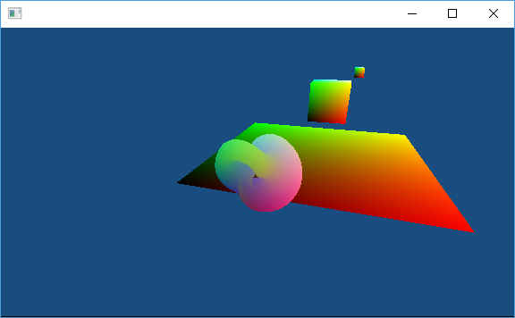

# Tile

Tile is a hobbyist 3D engine written in C mimicking the Blitz3D and Nuclear
Fusion APIs, with some twists, for OpenGL. This is just a "for fun" project.

License: ZLib. (i.e., "basically public domain.")

This project gets updated at random.

## How to build

You will want [msys2](http://www.msys2.org/) on Windows. Please choose the
64-bit version.

Build "Mk" first.

```sh
cc mk.c -o mk
```

After that, just run Mk.

```sh
./mk
```

The output of the engine test will be `bin/mswin-x64/engine-test-dbg.exe` on
Windows, or `bin/linux-x64/engine-test-dbg` on Linux. No other platform has been
tested at this time. (Though I would like to make sure everything works on
macOS, FreeBSD, (maybe NetBSD, Dragonfly, etc), and Haiku, eventually...)

## How to use... ?

Input:

```c
#include <tile.h>

/* ... snip ... */

int main() {
	double newTime, oldTime, deltaTime;

	/* initialization */
	tlInit();
	
	/* version control info */
#if BUILDGEN_GITINFO_AVAILABLE
	printf( "git-info:\n" );
	printf( "\tbranch: %s\n", BUILDGEN_GITINFO_BRANCH );
	printf( "\tcommit: %s\n", BUILDGEN_GITINFO_COMMIT );
	printf( "\ttstamp: %s\n", BUILDGEN_GITINFO_TSTAMP );
	printf( "\n" );
#endif
	
	tlSetCameraAutoAspect(1280.0/720.0, kTlAspect_Fit);

	g_shape = tlNewFigureEightTorus(tlFirstBrush(), 1.0f, 36);

	g_cube = tlNewCube(tlFirstBrush(), 1.0f);
	tlSetEntityPosition(g_cube, 0.5f,0.0f,5.0f);

	g_child = tlNewCube(tlFirstBrush(), 0.25f);
	tlSetEntityPosition(g_child, 0.7f,0.7f,0.7f);
	tlSetEntityParent(g_child, g_cube);

	g_plane = tlNewPlane(tlFirstBrush(), 10.0f, 10.0f);
	tlSetEntityPosition(g_plane, 0.0f,-3.5f,10.0f);
	tlTurnEntityX(g_plane, 90.0f);

	tlSetEntityParentGlobal(g_cube, g_plane);

	/* main loop */
	do {
		/* update */
		if( !update( tlGetDeltaTime() ) ) {
			break;
		}
	} while( tlLoop() );

	/* done */
	return EXIT_SUCCESS;
}
```

Output:



## Docs

See the header files in [pkg/tile/include/tile/](pkg/tile/include/tile/) for
documentation. (Not that there's much noted, and a lot of the APIs do what they
say on the tin.)

The organization of the engine is roughly as follows:

- The [engine](pkg/tile/include/tile/engine.h) is the glue that ties all the
  components together.
- It initializes a [screen](pkg/tile/include/tile/screen.h), which is the main
  window into the world. In rather, likely, the only window into the world.
- Additionally, the engine initializes the
  [rendering API](pkg/tile/include/tile/renderer.h). This is the low-level
  "abstract" renderer, that looks suspiciously exactly like OpenGL.
- You create [entities](pkg/tile/include/tile/entity.h) (oh wow, actual
  documentation in that file) which are the base objects of your 3D world. They
  are comprised of various components.
- Your window to the world is explored with a
  [camera](pkg/tile/include/tile/camera.h), which is just an entity with a view
  component attached.
- Visible entities are made up of [surfaces](pkg/tile/include/tile/surface.h),
  which are visually affected by [brushes](pkg/tile/include/tile/brush.h) and
  [lights](pkg/tile/include/tile/light.h).
- You can control your world via keyboard and mouse through the
  [event system](pkg/tile/include/tile/event.h).

That's about it for now. Some stuff in the pipeline is getting
[restructured](pkg/tile/include/tile/frame.h), and other things are just
generally [incomplete](pkg/tile/include/tile/console.h).

In case it matters to you, the entity rotation order is ZXY. This is the same
rotation order used by Nuclear Fusion (and IIRC, Unity). Optimized maths
available in a super secret file you'll never find if you're certain it's not in
a file labelled "`math`" with some relevant file extension like "`.c`." Though,
in hindsight, the compiler would probably optimize away all those multiplies by
0 and 1, so I probably didn't have to bother doing that by hand. Oh well, it's
easier to look at and reason about this way. (For me, anyhow.)

Again, this is just a project that I'm hacking together for fun. I document
capriciously.

Random trivia: This was originally a
[single file project](https://gist.github.com/NotKyon/a4b9554fec955538bcde383d8e682409)
of about 3000 lines.

## FAQ (Frequently Anticipated Questions)

### What does the name "Tile" mean?

I was originally going to do a 2D tilemapping test. I got distracted. (The test
did get completed outside of this project though.)

Anyway, since this was originally going to be for a tilemapping test, the name
"tile" was selected. Despite it spiralling into something else entirely, I stuck
with the name.

### What about using CMake as your build system?

CMake is smelly and gross.

jk.

I wrote Mk because at the time (2012~) CMake was really *very unpleasant* to
use, and I wanted a mostly configure-less build system that worked on the
platforms I cared about. If anybody's interested in writing a CMakeLists.txt for
this then feel free to. If it's reasonably slim, and does everything Mk does,
then I'd be happy to include it.

### Why should I bother using this over <*something else here*>?

You probably shouldn't. This is just a personal project, for fun. It is *not*
production code, nor is it well tested.

This project may be useful to you if the style of code and license matches what
you're after, and it does exactly what you want. Or perhaps it may be useful as
inspiration to write something better. No matter the case, it should be
something that you've recognized as being, in some way, useful to you.

In my case, it's a useful testbed for random API designs and for fun
distractions or tinkering. Maybe it can be that for you as well, or maybe not.

### Why C instead of C++?

It just sort of turned out that way. I was using C almost exclusively at the
time. I do feel that C++ is a way more realistic choice, and using it would
certainly cut down on the amount of time and effort it takes to get anything
done. Way safer in general, too.

### Why not port it to C++, or Rust, or Swift, or some other language?

I have considered porting it to Rust and Swift. That would take a lot of time,
especially for a Rust port, so I would rather not for now. Maybe some day...

### It doesn't build, but it should... why not?

Oops. Probably an oversight on my end. File an issue and I'll look into it.
